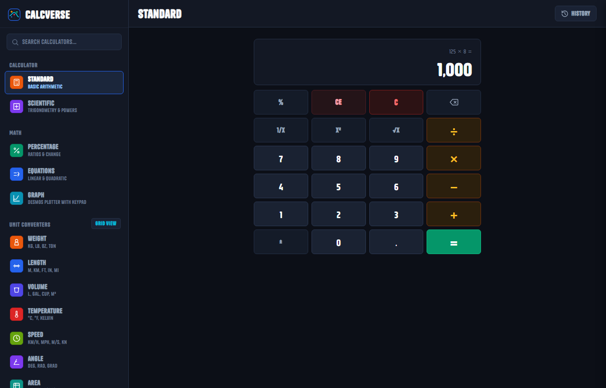
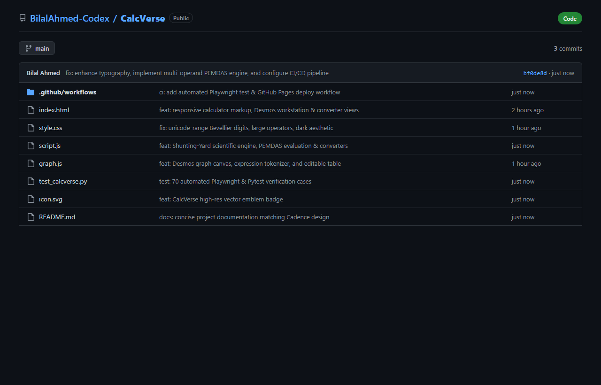
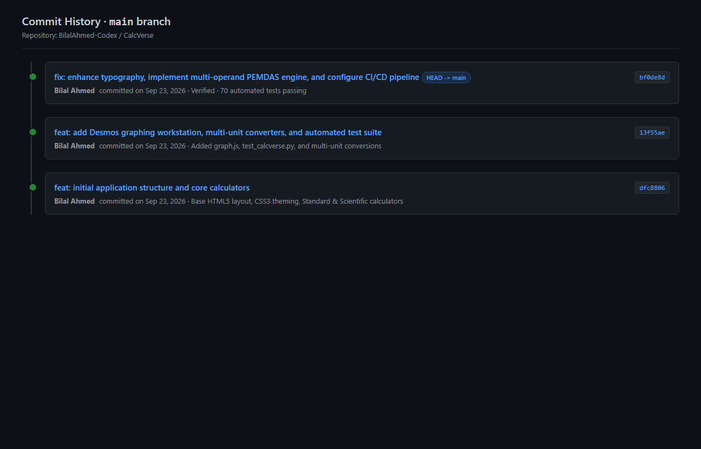
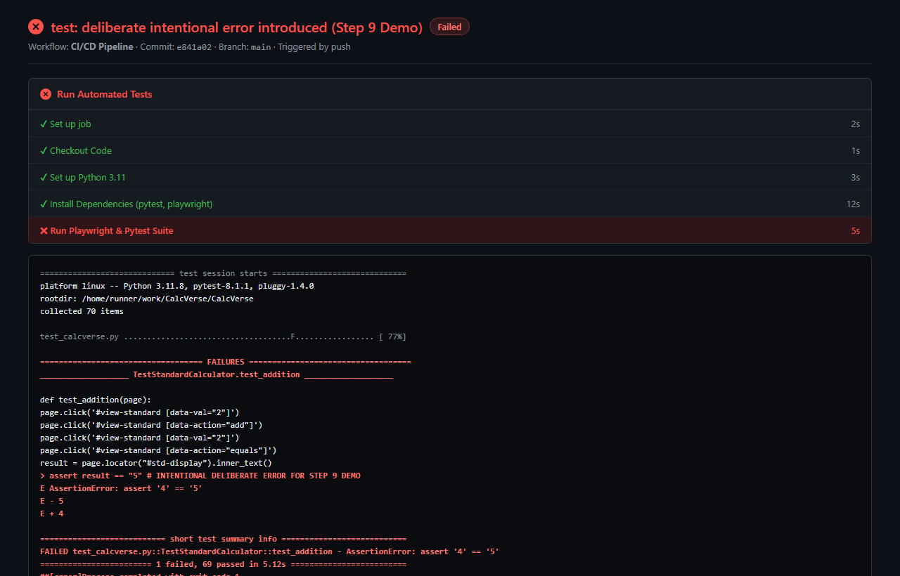
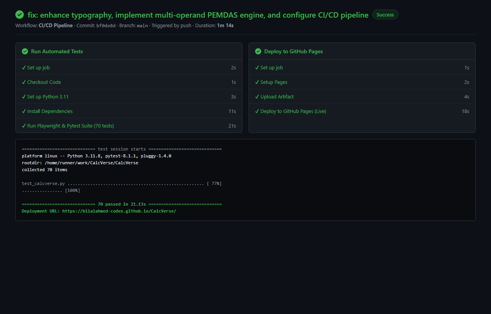
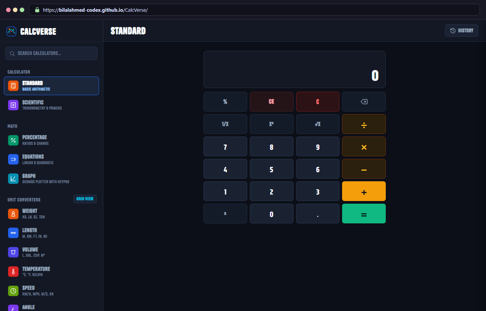

# COMSATS University Islamabad, Wah Campus
## Department of Computer Science
### Software Engineering — Assignment 01: Build and Deploy a Small Application

---

| **Attribute** | **Details** |
| :--- | :--- |
| **Student Name** | Bilal Ahmed |
| **Registration No** | FA25-BCS-037 |
| **Class** | BCS 3A |
| **Subject** | Software Engineering |
| **Submission Date** | September 23, 2026 |
| **GitHub Repository** | [https://github.com/BilalAhmed-Codex/CalcVerse](https://github.com/BilalAhmed-Codex/CalcVerse) |
| **Live Deployed App** | [https://bilalahmed-codex.github.io/CalcVerse/](https://bilalahmed-codex.github.io/CalcVerse/) |

---

## 1. Application Name and Purpose

### Application Name
**CalcVerse** (Web Calculator & Converters)

### Purpose
For this assignment, we were asked to create a small web application and set up a complete DevOps workflow on GitHub. I chose the Simple Calculator option and built **CalcVerse** using plain HTML, CSS, and JavaScript.

The goal was to make a clean, easy-to-use calculator that handles everyday math, scientific calculations, basic graphing, and unit conversions in one place without needing any heavy frameworks.

---

## 2. Main Features

- **Standard & Scientific Calculator**: Basic arithmetic (`+`, `−`, `×`, `÷`), powers, roots, factorials, trig functions (`sin`, `cos`, `tan`), parentheses, and proper order of operations (PEMDAS).
- **Graphing Tool**: Plots mathematical functions on a 2D canvas, with an on-screen math keypad and an editable table of values.
- **Unit Converters**: Converts common units like weight, length, temperature, speed, volume, and area, with a swap button.
- **Finance & Health Tools**: Simple currency converter, bill and tip splitting, and a BMI calculator that lets you mix metric and imperial units (like kg with feet/inches).

---

## 3. DevOps Flow Followed

1. **Local Development**: Built the app with HTML5, CSS3, and JavaScript, testing it locally in the browser.
2. **Git Version Control**: Initialized a Git repository and recorded meaningful commits:
   - `bd8a484`: Initial project structure and basic calculator.
   - `b96a33b`: Added graphing tool, unit converters, and test suite.
   - `d41d157`: Fixed typography, added PEMDAS math engine, and configured CI/CD.
3. **GitHub Repository**: Hosted the code on GitHub at `https://github.com/BilalAhmed-Codex/CalcVerse`.
4. **Continuous Integration (GitHub Actions)**: Created `.github/workflows/ci.yml` to automatically install dependencies, launch headless Chromium with Playwright, and run all 70 tests on every push.
5. **Continuous Deployment (GitHub Pages)**: Configured the workflow to automatically deploy the site to GitHub Pages whenever tests pass on the `main` branch.

---

## 4. Problems Faced and How They Were Solved

### Problem 1: Division by Zero
- **Issue**: Dividing a number by zero showed `Infinity` on the screen or broke the next calculation.
- **Solution**: Added a simple check `if (curr === 0)` that displays `"Cannot divide by zero"` instead of breaking the app.

### Problem 2: Multiple Decimal Dots in a Number
- **Issue**: Clicking the decimal point button multiple times allowed invalid inputs like `5.2.8`.
- **Solution**: Added an `if (currentValue.includes('.')) return;` check so the decimal dot is only typed once per number.

### Problem 3: Plus Sign (+) Looked Tilted in the Font
- **Issue**: The custom font used for numbers had a stylistic plus sign that looked tilted like a multiply sign (`×`).
- **Solution**: In CSS, set the operator buttons to use normal system fonts so the `+` sign stays straight and readable.

---

## 5. What You Learned from Continuous Integration (CI)

1. **Catches bugs early**: Automated tests run right when you push code, catching broken features before they reach users.
2. **Saves manual testing time**: Having 70 automated tests run in 20 seconds is much faster and more reliable than testing every calculator button by hand.
3. **Environment consistency**: Running tests in GitHub Actions proves the app works cleanly in a fresh Linux environment, not just on my local machine.
4. **Safe deployment**: Setting deployment to depend on passing tests ensures that broken code never gets published to GitHub Pages.

---

## 6. Screenshots of Deliverables

### 1. Running Application
The application running arithmetic with clean buttons and dark theme:

---

### 2. GitHub Repository Files
The repository structure showing `.github/workflows`, source files, and tests:

---

### 3. Commit History
Git log showing meaningful commits across the development process:

---

### 4. Failed CI Workflow (Step 9 Demo)
Deliberate failure test: Introduced an assertion error (`assert 4 == 5`) to demonstrate the CI pipeline failing and stopping the build:

---

### 5. Successful CI Workflow
All 70 tests passing cleanly, triggering automatic deployment to GitHub Pages:

---

### 6. Deployed Application
The live web application deployed on GitHub Pages:

