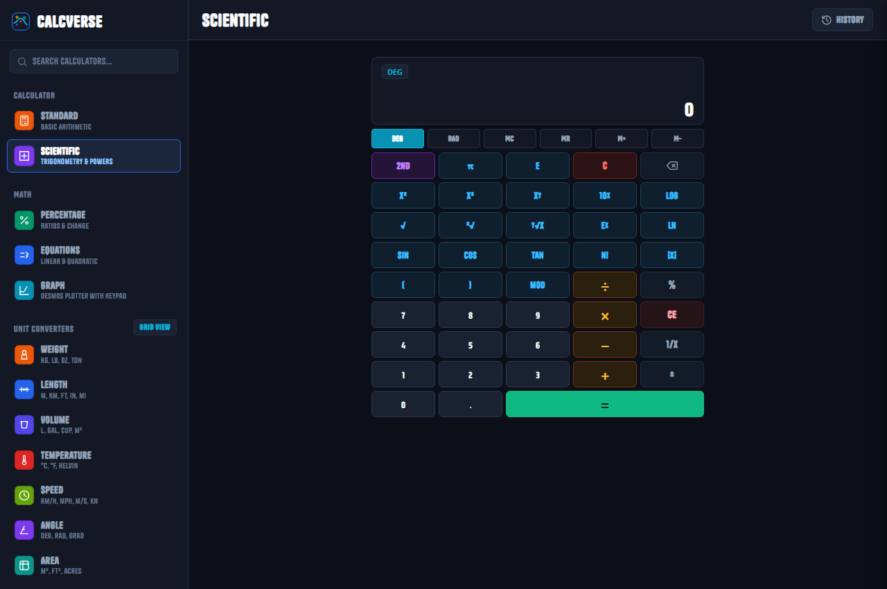

<div align="center">

<p align="center">
  
</p>

# CalcVerse

A web calculator with scientific math, graphing, and unit converters.

<p align="center">
  <a href="https://github.com/BilalAhmed-Codex/CalcVerse/actions/workflows/ci.yml"></a>
  <a href="https://github.com/BilalAhmed-Codex/CalcVerse"></a>
  <a href="https://bilalahmed-codex.github.io/CalcVerse/"></a>
  <a href="LICENSE"></a>
</p>

<p align="center">
  <a href="https://skillicons.dev">
    
  </a>
</p>

</div>

---

<p align="center">
  
</p>

## Features

- **Standard & Scientific** - Basic arithmetic, powers, roots, trig functions, and order of operations (PEMDAS).
- **Graphing** - Plot functions with an on-screen math keypad and table of values.
- **Unit Converters** - Convert weight, length, temperature, volume, speed, and area.
- **Finance & Health** - Currency exchange, bill splitting, and BMI calculator.

## Getting Started

Clone the repository and open `index.html` in your browser:

```bash
git clone https://github.com/BilalAhmed-Codex/CalcVerse.git
cd CalcVerse
```

### Running Tests

Run the test suite:

```bash
pytest test_calcverse.py
```

## License

MIT
